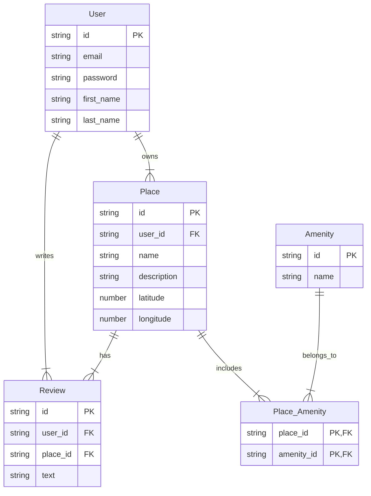

```mermaid
erDiagram
    User {
        string id PK
        string email
        string password
        string first_name
        string last_name
    }

    Place {
        string id PK
        string user_id FK
        string name
        string description
        number latitude
        number longitude
    }

    Review {
        string id PK
        string user_id FK
        string place_id FK
        string text
    }

    Amenity {
        string id PK
        string name
    }

    Place_Amenity {
        string place_id PK,FK
        string amenity_id PK,FK
    }

    User ||--|{ Place : "owns"
    User ||--|{ Review : "writes"
    Place ||--|{ Review : "has"
    Place ||--|{ Place_Amenity : "includes"
    Amenity ||--|{ Place_Amenity : "belongs_to"
```
