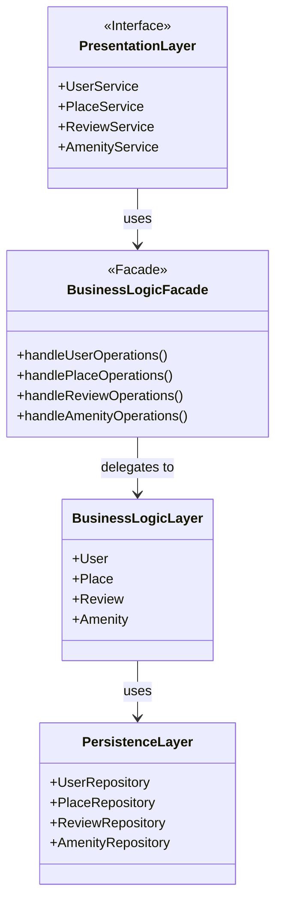

```mermaid
classDiagram
    class PresentationLayer {
        <<Interface>>
        +UserService
        +PlaceService
        +ReviewService
        +AmenityService
    }
    class BusinessLogicFacade {
        <<Facade>>
        +handleUserOperations()
        +handlePlaceOperations()
        +handleReviewOperations()
        +handleAmenityOperations()
    }
    class BusinessLogicLayer {
        +User
        +Place
        +Review
        +Amenity
    }
    class PersistenceLayer {
        +UserRepository
        +PlaceRepository
        +ReviewRepository
        +AmenityRepository
    }

    PresentationLayer --> BusinessLogicFacade : uses
    BusinessLogicFacade --> BusinessLogicLayer : delegates to
    BusinessLogicLayer --> PersistenceLayer : uses
```