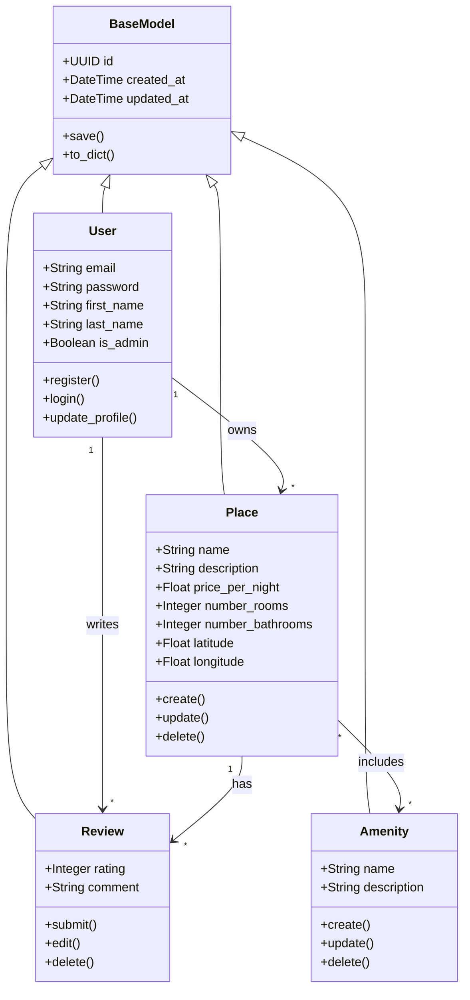

```mermaid
classDiagram
    class BaseModel {
        +UUID id
        +DateTime created_at
        +DateTime updated_at
        +save()
        +to_dict()
    }
    
    class User {
        +String email
        +String password
        +String first_name
        +String last_name
        +Boolean is_admin
        +register()
        +login()
        +update_profile()
    }
    
    class Place {
        +String name
        +String description
        +Float price_per_night
        +Integer number_rooms
        +Integer number_bathrooms
        +Float latitude
        +Float longitude
        +create()
        +update()
        +delete()
    }
    
    class Review {
        +Integer rating
        +String comment
        +submit()
        +edit()
        +delete()
    }
    
    class Amenity {
        +String name
        +String description
        +create()
        +update()
        +delete()
    }
    
    BaseModel <|-- User
    BaseModel <|-- Place
    BaseModel <|-- Review
    BaseModel <|-- Amenity
    User "1" --> "*" Place : owns
    User "1" --> "*" Review : writes
    Place "1" --> "*" Review : has
    Place "*" --> "*" Amenity : includes
```